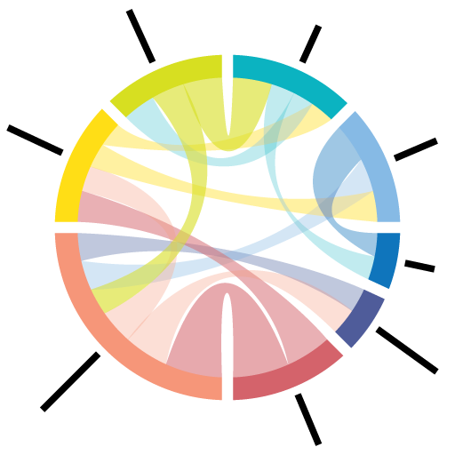

 See instructions in the comments below for how to edit specific sections of this workshop template. 


HEADER

Edit the values in the block above to be appropriate for your workshop.
If the value is not 'true', 'false', 'null', or a number, please use
double quotation marks around the value, unless specified otherwise.
And run 'make workshop-check' *before* committing to make sure that changes are good.






Check DC curriculum





It looks like you are setting up a website for a Data Carpentry curriculum but you haven't specified the curriculum type in the <code>_config.yml</code> file (current value in <code>_config.yml</code>: "<strong>{{ site.curriculum }}</strong>", possible values: <code>dc-ecology</code>, <code>dc-genomics</code>, <code>dc-socsci</code>, or <code>dc-geospatial</code>). After editing this file, you need to run <code>make serve</code> again to see the changes reflected.





Check SWC curriculum





It looks like you are setting up a website for a Software Carpentry curriculum but you haven't specified the curriculum type in the <code>_config.yml</code> file (current value in <code>_config.yml</code>: "<strong>{{ site.curriculum }}</strong>", possible values: <code>swc-inflammation</code>, or <code>swc-gapminder</code>). After editing this file, you need to run <code>make serve</code> again to see the changes reflected.





EVENTBRITE

This block includes the Eventbrite registration widget if
'eventbrite' has been set in the header.  You can delete it if you
are not using Eventbrite, or leave it in, since it will not be
displayed if the 'eventbrite' field in the header is not set.


<strong>Some adblockers block the registration window. If you do not see the
  registration box below, please check your adblocker settings.</strong>
<iframe
  src="https://www.eventbrite.com/tickets-external?eid={{page.eventbrite}}&ref=etckt"
  frameborder="0"
  width="100%"
  height="280px"
  scrolling="auto">
</iframe>


<h2 id="general">General Information</h2>


INTRODUCTION

Edit the general explanatory paragraph below if you want to change
the pitch.


[ForBio](https://www.forbio.uio.no/) and [UiB](https://www.uib.no/) Dead Wood Meeting 2021 satellite workshops cover (1) managing interactions data and (2) analysis and visualization of interaction datasets. The goal is to introduce basics of current informatics methods in working with interaction data to students and researchers of dead wood systems.

During this two-day participatory workshop, students and researchers will explore the current informatics methods used to work with interaction data "in the wild." Our group exploration will cover data origins, data integration, data publishing, data analysis, and data visualization. 

In the morning sessions, [Dr. Dmitry Schigel](http://adlignum.com/about/) (Monday) and [Dr. Talya Hackett](https://www.zoo.ox.ac.uk/people/dr-talya-hackett#/) (Tuesday) share their insights on topics like constructing, publishing, analyzing, and visualizing interaction data.

In the afternoon sessions, [Jorrit Poelen](https://jhpoelen.nl) facilitates hands-on assignments on current informatics methods to publish and reuse interaction data as well as introduces ways to visualize interactions data. 

The workshop was conceived and organized by [Dr. Dmitry Schigel](http://adlignum.com/about/), Scientific Officer at Global Biodiversity Information Facility (GBIF, [https://gbif.org](https://gbif.org)). 

For more information about the ForBio and UiB Dead Wood 2021 Meeting see <a href="https://www.forbio.uio.no/events/courses/2021/Deadwood_2021">ForBio's announcement</a> and the <a href="http://adlignum.com/teaching/dead-wood-meeting-2021/">meeting agenda</a>.

This workshop is open to registered participants. 

The proposed outcomes of this workshop are a reusable Carpentries lesson and improved documentation on methods to integrate, access, and visualize biotic interaction data through participant-written blog posts. We will work together through a series of exploratory data exercises. No programming experience is required, and you will use your own device to download data. Everyone will contribute during this workshop. Bring snacks! :)

## Acknowledgments
A special thanks to the thousands of (citizen) scientists and their institutions for openly sharing their [datasets](https://globalbioticinteractions.org/sources). Also, thanks to the thousands of software engineers who provide the high-quality open source software on which GloBI, GBIF, and other biodiversity infrastructures are built. 

The symposium is organized by ForBio and University Museum of Bergen, with the support from Lomonosov Moscow State University, the Norwegian University of Life Sciences, the Norwegian Institute for Nature Research, the University of Oslo, the Voronezhsky State Nature Biosphere Reserve, the University of Helsinki. Funding is provided by the [Directorate for Higher Education and Skills, Norwegian Ministry of Education and Research](https://hkdir.no/the-directorate-for-higher-education-and-skills) (formerly Norwegian Agency for International Cooperation and Quality Enhancement in Higher Education (Diku) and ForBio.

Finally, a big thanks to [Nataliya Budaeva](https://www.nataliyabudaeva.com) for coordinating workshop activities and logistics.

    

## Disclaimer

Note that this is not (yet) an official Carpentries workshop, but we are working towards becoming one.


AUDIENCE

Explain who your audience is.  (In particular, tell readers if the
workshop is only open to people from a particular institution.










LOCATION

This block displays the address and links to maps showing directions
if the latitude and longitude of the workshop have been set.  You
can use https://itouchmap.com/latlong.html to find the lat/long of an
address.











  <strong>Where:</strong>
  {{page.address}}.
  Get directions with
  <a href="//www.openstreetmap.org/?mlat={{page.latitude}}&mlon={{page.longitude}}&zoom=16">OpenStreetMap</a>
  or
  <a href="//maps.google.com/maps?q={{page.latitude}},{{page.longitude}}">Google Maps</a>.



  <strong>Where:</strong>
  online at <a href="{{page.address}}">{{page.address}}</a>.
  If you need a password or other information to access the training,
  the instructor will pass it on to you before the workshop.



  <strong>Where:</strong> This training will take place online.
  The instructors will provide you with the information you will need to connect to this meeting.




DATE

This block displays the date and links to Google Calendar.



  <strong>When:</strong>
  {{page.humandate}}.
  




SPECIAL REQUIREMENTS

Modify the block below if there are any special requirements.


  <strong>Requirements:</strong>
  
    Participants must bring a laptop with a
    Mac, Linux, or Windows operating system (not a tablet, Chromebook, etc.) that they have administrative privileges on.
  
    Participants must have access to a computer with a
    Mac, Linux, or Windows operating system (not a tablet, Chromebook, etc.) that they have administrative privileges on.
  
  They should have a few specific software packages installed (listed <a href="#setup">below</a>).


ACCESSIBILITY

Modify the block below if there are any barriers to accessibility or
special instructions.


  <strong>Accessibility:</strong>

  We are committed to making this workshop
  accessible to everybody. The workshop organizers have checked that:

<ul>
  <li>The room is wheelchair / scooter accessible.</li>
  <li>Accessible restrooms are available.</li>
</ul>

  Materials will be provided in advance of the workshop and
  large-print handouts are available if needed by notifying the
  organizers in advance.  If we can help making learning easier for
  you (e.g. sign-language interpreters, lactation facilities) please
  get in touch (using contact details below) and we will
  attempt to provide them.


  We are dedicated to providing a positive and accessible learning environment for all. Please
  notify the instructors in advance of the workshop if you require any accommodations or if there is
  anything we can do to make this workshop more accessible to you.




CONTACT EMAIL ADDRESS

Display the contact email address set in the configuration file.


  <strong>Contact:</strong>
  Please email
  
  
  
  or
  
  
  ,
  
  
  <a href='mailto:{{email}}'>{{email}}</a>
  
  
  to-be-announced
  
  for more information.

  <strong>Roles:</strong>
  To learn more about the roles at the workshop (who will be doing what),
  refer to <a href="https://carpentries.org/workshop_faq/#what-are-the-roles-of-everyone-participating-in-a-workshop">our Workshop FAQ</a>.


WHO CAN ATTEND?

If you would like to specify who can attend the workshop,
you can use the section below.

Move the 'endcomment' tag above the beginning of the following

 tag to make this section visible.

Edit the text to match who can attend the workshop. For instance:
- This workshop is open to affiliates to ABC university.
- This workshop is open to the public.
- If you are interested in attending this workshop, contact me@example.com
  for more information

    <strong>Who can attend?:</strong>
    This workshop is open to ....




CODE OF CONDUCT

<h2 id="code-of-conduct">Code of Conduct</h2>

Everyone who participates in Carpentries activities is required to conform to the <a href="https://docs.carpentries.org/topic_folders/policies/code-of-conduct.html">Code of Conduct</a>. This document also outlines how to report an incident if needed.

  <a href="https://goo.gl/forms/KoUfO53Za3apOuOK2">
    <button type="button" class="btn btn-info">Report a Code of Conduct Incident</button>
  </a>


Collaborative Notes

If you want to use an Etherpad, go to

https://pad.carpentries.org/YYYY-MM-DD-site

where 'YYYY-MM-DD-site' is the identifier for your workshop,
e.g., '2015-06-10-esu'.

Note we also have a CodiMD (the open-source version of HackMD)
available at https://codimd.carpentries.org


<h2 id="collaborative_notes">Collaborative Notes</h2>

We will use this <a href="{{ page.collaborative_notes }}">collaborative document</a> for chatting, taking notes, and sharing URLs and bits of code.




SCHEDULE

Show the workshop's schedule.

Small changes to the schedule can be made by modifying the
`schedule.html` found in the `_includes` folder for your
workshop type (`swc`, `lc`, or `dc`). Edit the items and
times in the table to match your plans. You may also want to
change 'Day 1' and 'Day 2' to be actual dates or days of the
week.

For larger changes, a blank template for a 4-day workshop
(useful for online teaching for instance) can be found in
`_includes/custom-schedule.html`. Add the times, and what
you will be teaching to this file. You may also want to add
rows to the table if you wish to break down the schedule
further. To use this custom schedule here, replace the block
of code below the Schedule `<h2>` header below with
``.


<h2 id="schedule">Schedule</h2>




SETUP

Delete irrelevant sections from the setup instructions.  Each
section is inside a 'div' without any classes to make the beginning
and end easier to find.

This is the other place where people frequently make mistakes, so
please preview your site before committing, and make sure to run
'tools/check' as well.


<h2 id="setup">Setup</h2>

  To participate in a
  
  Software Carpentry
  
  Data Carpentry
  
  Library Carpentry
  
  workshop,
  you will need access to software as described below.
  In addition, you will need an up-to-date web browser.

  We maintain a list of common issues that occur during installation as a reference for instructors
  that may be useful on the
  <a href = "{{site.swc_github}}/workshop-template/wiki/Configuration-Problems-and-Solutions">Configuration Problems and Solutions wiki page</a>.


For online workshops, the section below provides:
- installation instructions for the Zoom client
- recommendations for setting up Learners' workspace so they can follow along
  the instructions and the videoconferencing

If you do not use Zoom for your online workshop, edit the file
`_includes/install_instructions/videoconferencing.html`
to include the relevant installation instrucctions.






These are the installation instructions for the tools used
during the workshop.









Please check the "Setup" page of
[the lesson site]({{ site.lesson_site }}) for instructions to follow
to obtain the software and data you will need to follow the lesson.

